## Agenda {.agenda}

1. Respond to syllabus feedback and reiterate AI disclosure policy
2. Recap of previous lecture: Research topic as question + setting + data
3. Recap of causal inference
4. Examples of topics motivated by question vs. setting vs. data
5. Advice on spotting questions, settings, and data

::: {.notes}
Start here, then navigate to the separate syllabus-feedback deck for item 1.
Return to the next slide for item 2. The title slide follows the same format
as lecture 1; the agenda is the first content slide.
:::

## Recap: question + setting + data {.recap}

- **Question:** what your paper will answer
    - Motivated by economic theory or a policy issue
- **Setting:** institutional details that enable a causal comparison or test of a theory
- **Data:** measurements used to answer the question in the setting
- You will iterate among these components as you learn more about each one
- Examples last time: housing development (causal) and private information in insurance (descriptive)

## Recap of causal inference {.section-divider}

## Causal inference basics

- A causal **question** asks what *would* happen to outcome $Y$ if treatment $D$ changed
- In the **data**, we can observe only what *actually* happens for each unit $i$
- We address the missing counterfactual with assumptions based on institutional knowledge of the **setting**
    - Free, detailed, and approachable online textbook: [Causal Inference: The Mixtape](https://mixtape.scunning.com/)
    - Animated visualizations of some approaches: [Nick Huntington-Klein's website](https://nickchk.com/causalgraphs.html)

::: {.notes}
Each research design gives a reason that an observed comparison can represent
the missing counterfactual. The next slides make these reasons precise.
:::

## The fundamental problem of causal inference {.potential-outcomes}

- Notation: potential outcomes for unit $i$ (at time $t$) are $Y_i(1)$ when $D_i=1$, $Y_i(0)$ when $D_i=0$

| Realized treatment | $Y_i(1)$ | $Y_i(0)$ |
|:---|:---:|:---:|
| $D_i=1$ | Observed | Missing |
| $D_i=0$ | Missing | Observed |

- Problem: We cannot identify the individual causal effect $Y_i(1)-Y_i(0)$
- Solution: An identification strategy states the assumptions that let us learn a causal effect from observed data

::: {.notes}
A unit might be a person, firm, school, or municipality. The potential outcomes
refer to the same unit at the same time under two treatment states, not its
before and after outcomes.

Identification asks which assumptions make the causal quantity recoverable
from observed data. Estimation is how we estimate it from a sample. More
observations do not by themselves solve identification.
:::

## Selected strategies for identifying causal effects

1. Randomized controlled trial
2. Selection on observables
3. Instrumental variables
4. Regression discontinuity
5. Bunching
6. Difference-in-differences

## Randomized controlled trial {.diagram-slide}

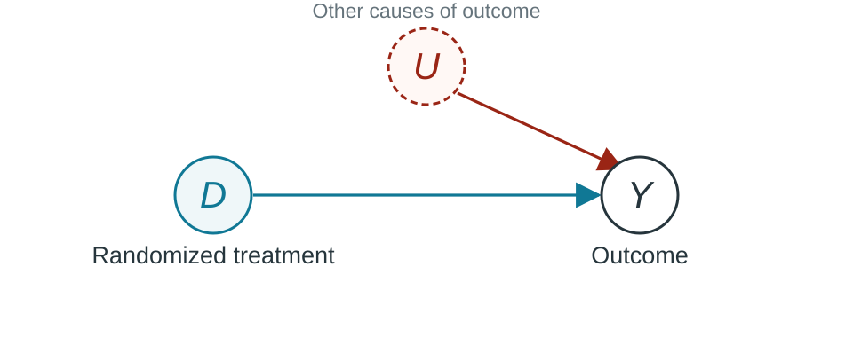{.causal-diagram fig-alt="Randomly assigned treatment D points to outcome Y. An unobserved cause U points to Y but not to D."}

- Random assignment makes the groups comparable on average
- The untreated-group mean estimates the treated group's counterfactual mean

::: {.notes}
An arrow represents a possible causal effect, not an association or regression
coefficient. D is randomized treatment; Y is the outcome.

U represents other causes of Y. Randomization does not remove these causes;
it prevents them from determining treatment. Assume
treatment follows assignment, no interference, and no selective attrition.

D is independent of (Y(1), Y(0)), so E[Y | D=1] - E[Y | D=0] identifies
E[Y(1)-Y(0)]. The estimate still has sampling uncertainty. Randomization
solves the average comparison problem, not each individual's missing outcome.
:::

## Observational data: what else determines treatment? {.diagram-slide}

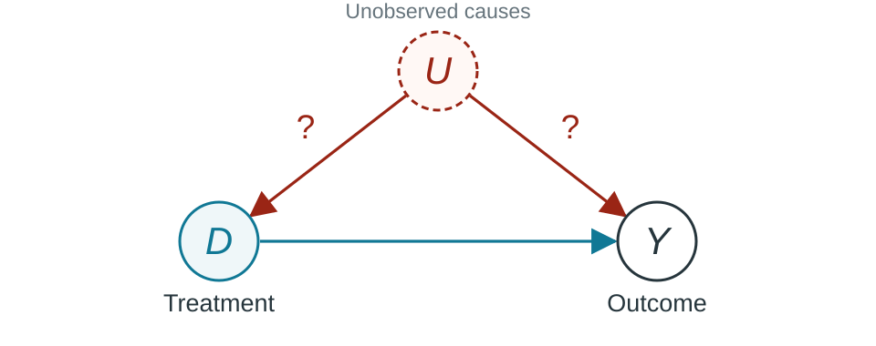{.causal-diagram fig-alt="D points to Y. Unobserved causes U point to both D and Y, with a question mark on each confounding arrow."}

- $D$ and $Y$ may share unobserved causes, $U$
- Association combines the causal path with $D \leftarrow U \rightarrow Y$

::: {.notes}
People choose treatment or institutions assign it. U might include motivation,
expected demand, or political priorities.

Question marks flag uncertainty about the mechanisms and their strength.
They are teaching annotations, not a formal DAG symbol. The arrows do not
establish the sign or size of bias.

A backdoor path starts with an arrow into D. Here D <- U -> Y connects D and
Y apart from D's causal effect. Learning who receives treatment and why is
part of learning the setting. A DAG records assumptions; it does not verify them.

Reference: Cunningham's [online textbook](https://mixtape.scunning.com/),
chapter on directed acyclic graphs.
:::

## Exercise: interrogating causal relationships

[The Economist, “Is AI putting graduates out of work already?”](https://www.economist.com/finance-and-economics/2026/05/13/is-ai-putting-graduates-out-of-work-already)

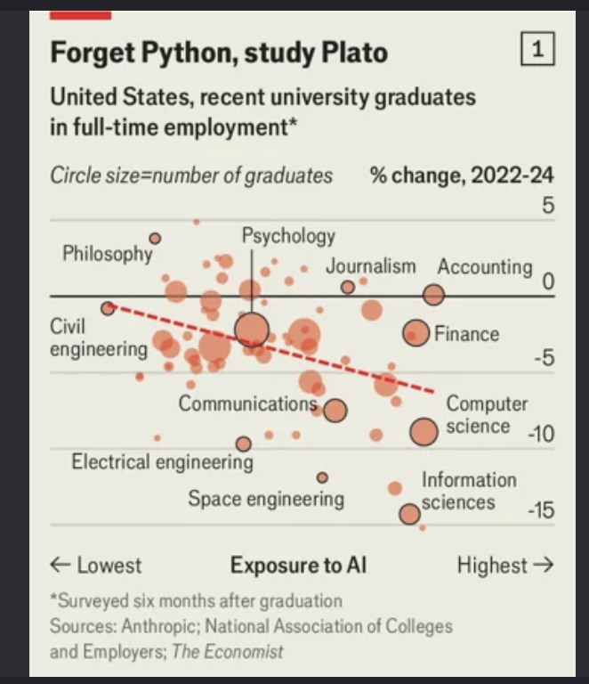{.economist-shot fig-alt="Screenshot from The Economist article about whether AI is putting graduates out of work."}

- State the causal relationship that the graph's title implies.
- State alternative causal explanations consistent with the data.

::: {.notes}
Students work individually. Identify treatment, outcome, and unit, then write
two reasons the relationship need not be causal: selection, reverse causality,
omitted variables, changing composition, or measurement. This interrogates a
claim; it is not a project-design exercise.
:::

## Observational design #1: selection on observables {.diagram-slide}

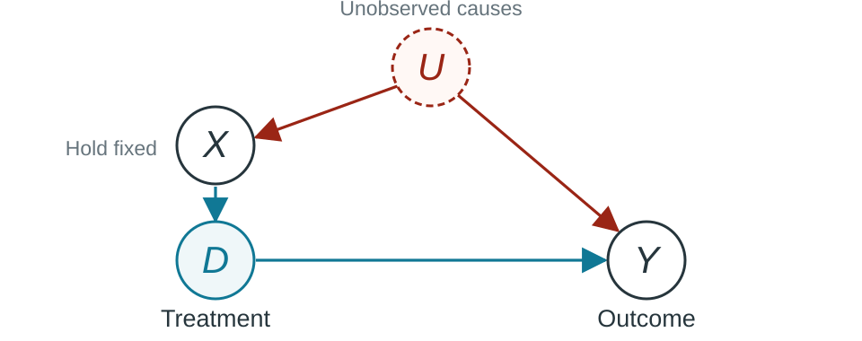{.causal-diagram fig-alt="U points to observed X and to Y; X points to D, and D points to Y. Conditioning on X blocks the misleading path through U."}

- Compare treated and untreated units with the same pre-treatment $X$
- Assumption: comparing within $X$ blocks the confounding "backdoor" path from $D$ to $Y$

## A control is not automatically enough {.diagram-slide}

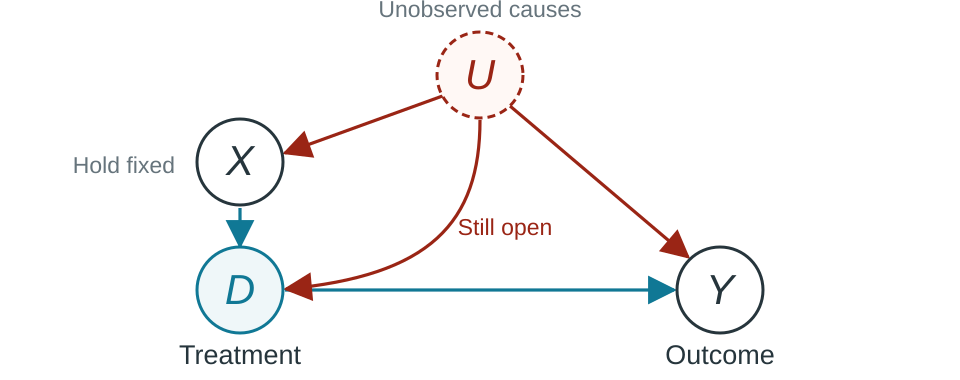{.causal-diagram fig-alt="The preceding DAG with an additional U to D arrow. Conditioning on X leaves the misleading path through U open."}

*Key question:* Why is variation in $D$ as good as random within $X$?

::: {.notes}
Change one assumption: U also affects treatment other than through X. Now
holding X fixed does not eliminate D <- U -> Y. A noisy proxy for an omitted
cause need not suffice.

Ask: what institutional fact would persuade you that the extra arrow is absent?
The answer should concern assignment, not statistical significance.

Use pre-treatment covariates with a causal rationale. Controlling for a mediator
can remove part of the effect; controlling for a collider can introduce bias.
Do not detour into a full catalog of DAGs here.
:::

## Advice: pursuing selection on observables

- Setting as motivation: treatment is assigned systematically but you observe the relevant inputs
    - [Abdulkadiroğlu, Angrist, Narita, and Pathak (2017)](https://doi.org/10.3982/ECTA12917): centralized school assignment uses priorities and preferences that the researcher observes
    - [Borusyak and Hull (2023)](https://onlinelibrary.wiley.com/doi/abs/10.3982/ECTA19367): Chinese high-speed rail proposals had equally-suitable connections but only some were built
- Data as motivation: language models can represent high-dimensional, nonstandard data
    - [Bajari et al. (2025)](https://arxiv.org/abs/2305.00044): encode product text and images as quality controls in a hedonic price index

::: {.notes}
The first example is a direct selection-on-observables example. Centralized
school assignment follows a documented mechanism based on priorities and
preferences. If the researcher observes those inputs, comparisons within the
assignment cells can be credible.

The second example is not a causal paper. It is a data-first example of making
high-dimensional product quality observable. Use it to motivate richer controls
and measurement, but do not present it as evidence that a causal effect is
identified. For a causal application, students would still need a treatment,
an outcome, and an assignment argument.
:::

## Observational design #2: instrumental variables {.diagram-slide}

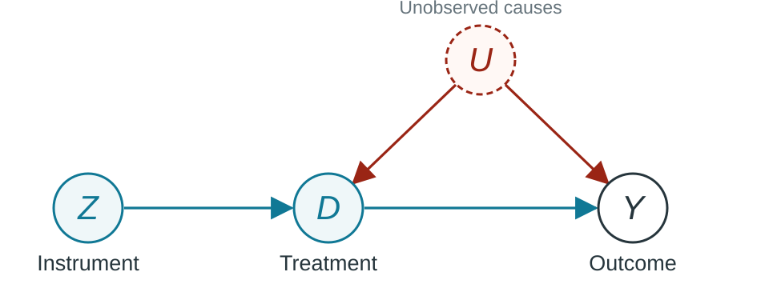{.causal-diagram fig-alt="Z points to D and D points to Y. U points to D and Y. A crossed dashed path from Z to Y indicates no direct path."}

- Focus on the variation in $D$ induced by $Z$
- Assumptions:
    1. First stage: $Z$ changes $D$
    2. Independence: $Z$ and $Y$ have no common causes
    3. Exclusion: $Z$ affects $Y$ only through $D$

::: {.notes}
Introduce IV before DiD. The assumptions are relevance, exogeneity, and
exclusion. Bridges will be a concrete setting-first example. Cunningham's
common designs include random assignment, encouragement, institutional rules,
geographic or physical constraints, and lotteries. RDD is the cutoff case.
:::

## Advice: pursuing instruments

- Setting as motivation: know one specific observable factor that changes treatment
    - [Geography](https://www.aeaweb.org/articles?id=10.1257/aer.89.3.379), [weather](https://academic.oup.com/qje/article-abstract/128/4/1633/1849540), or [institutional quirks](https://academic.oup.com/qje/article-abstract/106/4/979/1873496)
    - [Decision-makers with different tendencies](https://arxiv.org/abs/2511.03572), with as-if-random assignment to the decision-maker

::: {.reference}
[Cunningham, “Five Common Distinct IV Designs”](https://mixtape.scunning.com/07-instrumental_variables#five-common-distinct-iv-designs)
:::

::: {.notes}
Use these categories as prompts for finding settings, not as proof that an
instrument is valid.

Lotteries include randomized offers when take-up is incomplete. Decision-maker
designs use differences such as judge leniency and require assignment to the
decision-maker to be as-if random. Bartik instruments combine local exposure
shares with common shocks; both components need a substantive argument. A
fuzzy RDD uses a cutoff that changes the probability of treatment. Demand
applications use a shifter of supply or cost that does not directly change
demand.

For each proposed instrument, ask students to describe the first stage in one
sentence and then list every plausible route from the instrument to the outcome
that does not pass through treatment. Institutional knowledge is essential for
both tasks.
:::

## Observational design #3: regression discontinuity

$$D_i = 1[X_i \geq c]$$

$$\tau_{RDD} = \lim_{x \downarrow c} E[Y_i \mid X_i=x]
- \lim_{x \uparrow c} E[Y_i \mid X_i=x]$$

- Treatment changes at cutoff $c$
- Assumption: average untreated potential outcomes are continuous at $c$

::: {.notes}
Do not use a DAG here. The assignment rule and the comparison immediately on
either side of the cutoff state the research design more clearly.

The displayed estimand is for a sharp RDD. It identifies a local effect at the
cutoff if potential outcomes vary smoothly through the cutoff and units cannot
precisely manipulate which side they fall on. Other policies or rules must not
change at the same cutoff.
:::

## Advice: pursuing regression discontinuity

- Setting as motivation: find a stark cutoff rule that changes treatment
    - [Lee (2008)](https://doi.org/10.1257/aer.98.3.808): narrowly winning an election changes whether a party holds office
- Learn exactly how the running variable and cutoff determine treatment
- Ask whether units can sort around the cutoff or whether other rules change there

::: {.notes}
Close elections are intuitive because vote share has a clear threshold: just
below 50 percent, a candidate loses; just above it, the candidate wins. The
comparison is local. It does not imply that election winners are random far
from the cutoff.
:::

## Exercise: a tax notch and a regression discontinuity

Los Angeles' mansion tax has a sharp notch: no tax below a $5.4 million sale price and a 4% tax on the full price above it.

**3 minutes:** Is the threshold a useful cutoff for an RDD?

::: {.notes}
Identify the running variable, cutoff, treatment, and outcome. Then ask what
agents might do when crossing the threshold is costly. A sharp policy rule can
create incentives to manipulate the running variable.
:::

## Observational design #4: bunching

- If people can sort around a threshold, an RDD comparison is not clean
- Make lemons into lemonade: the sorting itself is informative
- Infer the smooth **counterfactual density** without the notch
- **Bunching:** use excess mass near the cutoff to measure behavioral responses

::: {.notes}
The mansion-tax example turns a failed RDD into a useful measurement idea.
Bunching returns to the fundamental causal problem: we observe the density with
the tax notch but need the density that would have existed without it. A smooth
extension of the density away from the notch supplies that counterfactual.
Comparing the observed and counterfactual densities measures how strongly
people respond to the incentive. This is a preview.
:::

## Observational design #5: difference-in-differences

- Observe treated and untreated groups before and after treatment begins
- Group levels may differ before treatment
- Use the untreated group's change to infer the treated group's counterfactual change

::: {.notes}
One sufficient model is Y_it(0) = alpha_i + lambda_t + epsilon_it, with equal
average changes in epsilon across groups. Differencing removes alpha_i;
comparing changes removes the common lambda_t. U being time-invariant alone
is not sufficient; how it contributes to outcomes also matters.

The plots on the next slides express the identifying assumption more clearly
than a DAG. Controlling for the baseline outcome and taking differences are
not the same design.
:::

## Difference-in-differences: what we observe {.plot-slide}

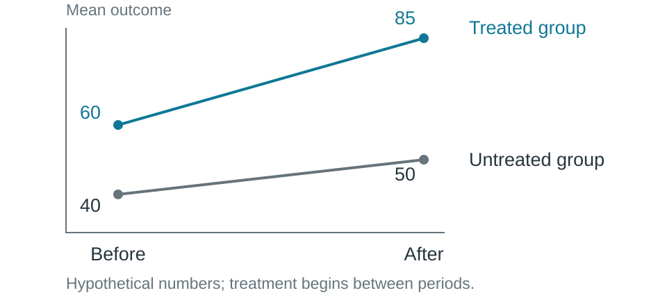{.trend-diagram fig-alt="Hypothetical mean outcomes: the treated group rises from 60 before treatment to 85 after; the untreated group rises from 40 to 50."}

::: {.notes}
Invented numbers, not estimates. Treatment begins between the periods.

The post-treatment group difference (85 - 50) includes pre-existing differences.
The treated group's before/after difference (85 - 60) includes changes that
would have happened anyway.

Ask students for the missing quantity: the treated group's mean AFTER the
event if it had NOT received treatment. Its baseline of 60 is not automatically
that counterfactual. This is the earlier potential-outcome problem at the
level of the treated group's average.
:::

## Difference-in-differences: infer the missing trend {.plot-slide}

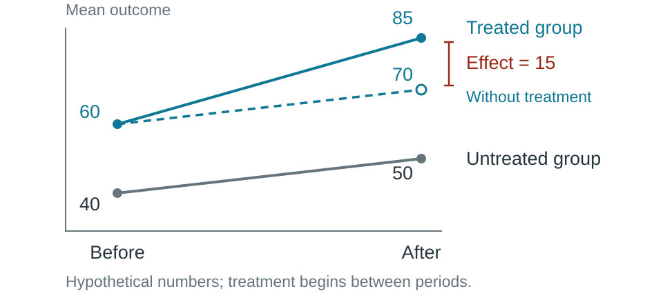{.trend-diagram fig-alt="The preceding observed means, plus a dashed untreated counterfactual for the treated group from 60 to 70. The gap to its observed outcome of 85 is an effect of 15."}

**Parallel trends assumption:** the untreated potential outcomes of both groups change similarly, even if their levels are different

::: {.notes}
The untreated group rises by 10. Impute the treated group's untreated
post-treatment mean as 60 + 10 = 70. The effect is 85 - 70 = 15.
Equivalently, DiD = (85 - 60) - (50 - 40) = 15.

Under the assumptions this identifies the average effect on the treated,
not necessarily on everyone. The dashed line is inferred, not observed.

With G indicating fixed group membership:
E[Y_after(0)-Y_before(0) | G=1] =
E[Y_after(0)-Y_before(0) | G=0].
Actual treatment occurs only afterward.

Reference: [difference-in-differences fundamentals](https://mixtape.scunning.com/08a-difference_in_differences).
:::

## Advice: pursuing difference-in-differences

- Setting as motivation: a policy changes for some groups but not others or rolls out gradually
- Similar pre-treatment trends are useful evidence, not proof
- Institutional knowledge must support the comparison group and timing

::: {.notes}
Parallel trends restricts counterfactual MEAN CHANGES, not outcome levels.

Describe it as a restriction on untreated outcome evolution, not simply a
linear-trend assumption. Common trends can be nonlinear. Outcome scale
matters: parallel changes in levels need not imply parallel changes in logs.

Why this jurisdiction adopted the policy at this date matters. Adoption in
response to an expected local boom could imply a different untreated trend.

Seek several pre-treatment periods, a credible untreated comparison, stable
measurement and composition, and no anticipation or spillovers. Staggered
adoption needs additional care; do not present an unrestricted two-way
fixed-effects regression as the universal implementation.

The point is to recognize an opportunity and the assumption to investigate.
:::

## Forming a research topic {.section-divider}

## Economics is a broad field

- Be creative in seeing economic concepts
- [Examples of economic research across a variety of fields](https://docs.google.com/document/d/15kgn_m3mmpEQ9fvd0C6rSTc6gKXV99-SuPFjlrpiqGE/)

## Three ways to start

- Research is a nonlinear and iterative process
- The following slides highlight papers that plausibly came from different starting points:
    - **Question-led:** something you want to understand
    - **Setting-led:** an institutional detail that makes evidence informative
    - **Data-led:** an opportunity to measure something previously hard to see

## Question-led: does Nash equilibrium predict behavior?

- **Starting question:** Do the predictions of Nash equilibrium apply in the real world?
- **Your task:** Find behavior that reveals players' strategies and payoffs
- **Hint:** What is a relevant setting with *players* and *games*?

::: {.notes}
Give students a moment to suggest observable games before revealing the tennis
example. The point is to start with a broad theoretical question, then search
for a setting where actions and outcomes can be measured cleanly.
:::

## Question-led: mixed strategies at Wimbledon

- **Question:** test Nash equilibrium in a real-world game
- **Setting:** tennis servers and receivers choose left or right simultaneously
    - A mixed-strategy Nash equilibrium predicts equal success rates across actions used with positive probability
- **Data:** Wimbledon match videos
- [Walker and Wooders (2001), “Minimax Play at Wimbledon”](https://www.aeaweb.org/articles?id=10.1257/aer.91.5.1521)
- Broader lesson: Economics is not only what appears in the newspaper's business section

::: {.notes}
The setting makes the theory observable: serve direction records the action,
and the point outcome measures the payoff. The paper asks whether professional
players randomize as minimax theory predicts. Stress the path from question to
setting and data, not the tennis result in isolation.
:::

## Setting-led: where can a bridge be built?

- A tributary increases downstream river flow and bridge-construction costs
- Bridges are more common just upstream of confluences
- **Your task:** What economic question could this variation answer?
- **Hint:** Why do we care about variation in bridge access?

::: {.notes}
Let students first turn the institutional fact into a treatment and an outcome.
The engineering constraint suggests variation in bridge access that is not
simply a response to local demand.

:::

## Setting-led: bridges and economic development

- **Setting:** river geography creates variation in bridge access
- **Question:** what is the economic impact of transportation infrastructure investment?
- **Data:** river geography and bridge locations
- [Tompsett (2026), “Bridges”](https://academic.oup.com/restud/article/93/5/3394/8402958?login=false#574045557)
- Broader lesson: Expertise outside economics is useful

::: {.notes}
Relate upstream position around a confluence to Z, connectivity to D, and local
economic activity to Y.

A credible design must address other consequences of river geography,
including routes unrelated to bridges. “Geographic” does not mean exogenous.
This motivates investigating a design; it does not prove validity.

The paper also studies major bridge openings. Keep this slide focused on the
confluence comparison rather than combining its distinct designs.

Source: [published paper](https://doi.org/10.1093/restud/rdaf104).
:::

## Data-led: local housing permits

- [D'Amico, Soltas, and Wang (2026)](https://evansoltas.com/papers/Durations_DSW2026.pdf) collect housing permit records across 60 U.S. cities, 2000–2025
- Measures the time from a permit application to completion
- **Your task:** Why could we care about these data?

::: {.notes}
A data-first way to read the paper, not an assertion about its actual origin.
Give students time to propose outcomes, comparisons, and descriptive facts.
Municipal portals and public-records requests supply dates that can become
comparable durations.

Core records are public; supplementary property information includes Cotality.
Do not describe every input as openly downloadable.

Source: [paper, sections 1–2](https://evansoltas.com/papers/Durations_DSW2026.pdf).
:::

## Data-led: where is housing slow to build?

- **Data:** newly harmonized data on permitting timelines
- **Question:** is housing slower to build in high-cost places?
- **Setting:** developers must apply for permits, and approval processes differ across cities
- Broader lesson: Harmonizing scattered public records can benefit both your project and other researchers

::: {.notes}
Descriptive measurement connects to economic reasoning without identifying
a causal effect of a particular regulation.

The broader lesson: public information may be costly to assemble and compare.
Making it usable can create social value. This public-good point is a potential
contribution, not a claim about what this paper has released.

Save collection, linkage, and exploration for the later lecture.
Reference: [D'Amico, Soltas, and Wang](https://evansoltas.com/papers/Durations_DSW2026.pdf).
:::

## Finding inspiration {.section-divider}

## Start with what you already know

- Internships, hometowns, hobbies, and historical knowledge
- Notice rules: prices, queues, eligibility, assignments, and contracts

::: {.notes}
Recall an actual institutional detail, not just an industry. Who sets a price?
How does a queue move? What changes at a threshold?

Institutional knowledge can expose a theoretical prediction or a causal-design
opportunity. Do not force every rule into IV or DiD. Familiarity does not imply
access to private employer records; obtainable data still matter.
:::

## Review unique data aggregators

- Proprietary datasets: [Dewey Data](https://www.deweydata.io/)
- Unusual datasets: [Data Is Plural](https://www.data-is-plural.com/)
- Freedom of Information Act releases: [Data Liberation Project](https://www.data-liberation-project.org/)

::: {.notes}
Discovery sources for unusual measurement opportunities, not standard datasets
or a tour of data catalogs. Ask what an observation represents and what
economic concept it measures. Novelty alone is not a question.

An established dataset can later supply outcomes or controls once there is a
distinctive starting point. Do not drift into scraping, cleaning, or
exploratory-analysis instruction.
:::

## Read the newspaper with a discerning eye

- **Question:** why does this story matter?
- **Setting:** is there a rule, reform, or incentive?
- **Data:** does the story identify an unusual measurement?

- Major outlets: [WSJ](https://www.wsj.com/), [NYT](https://www.nytimes.com/), [FT](https://www.ft.com/), [Bloomberg](https://www.bloomberg.com/)
- Long-form discovery: [Longreads](https://longreads.com/); investigative reporting: [ProPublica](https://www.propublica.org/)
- Specialized outlets: [Governing](https://www.governing.com/), [State Newsroom](https://statesnewsroom.com/), [Utility Dive](https://www.utilitydive.com/), [Waste Dive](https://www.wastedive.com/)

::: {.notes}
Longreads is a way to discover specialist topics and publications, not just
a list of project articles. Detailed reporting can reveal useful institutions.

Proposed SKILL-PRACTICE activity: the instructor opens a section and supplies
an article; students do not bring articles. Individually, extract one concrete
question, setting, or data lead, then identify a missing fact needed to make
it a project. An article need not supply all three components.

Debrief: distinguish facts in the article from students' conjectures. A policy
change is not automatically exogenous; mentioned records may not be public.

This teaches a reading skill, separate from the own-project work at the end.
:::

## Boston Globe case study: headline

[Boston Globe: “This program is driving up gas bills in Massachusetts. Did it make customers safer?”](https://www.bostonglobe.com/2026/09/13/science/gsep-natural-gas-energy-affordability/?event=event12)

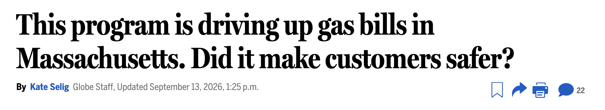{fig-alt="Boston Globe headline: This program is driving up gas bills in Massachusetts. Did it make customers safer?" width="100%"}

::: {.notes}
The title already contains a policy question: customers pay for accelerated
replacement of old gas pipes, but did the program improve safety? Ask students
to identify the question, treatment, and outcome before continuing.
:::

## Boston Globe case study: question

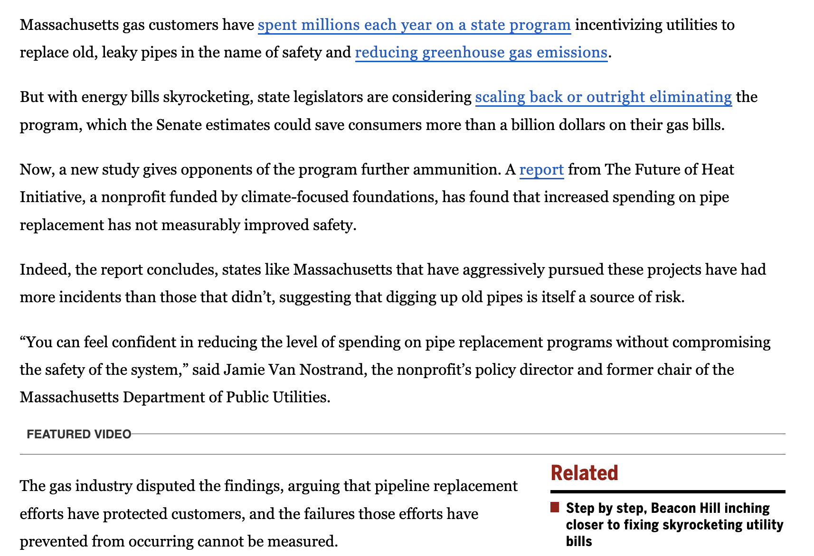{fig-alt="Boston Globe text describing the cost, safety, and emissions motivations for replacing old natural-gas pipes." width="92%"}

::: {.notes}
The program raises gas bills and is intended to improve safety and reduce
greenhouse-gas emissions. Those claims provide economic and policy motivation.
The dispute also makes the missing counterfactual clear: what would safety have
been without accelerated pipe replacement?
:::

## Boston Globe case study: data

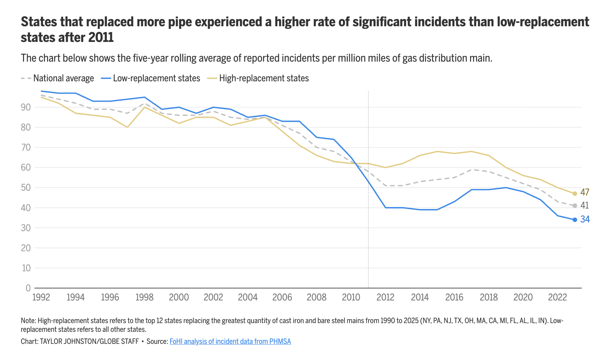{fig-alt="Boston Globe chart comparing reported gas-pipeline incidents in states with high and low rates of pipe replacement." width="92%"}

::: {.notes}
The chart uses public PHMSA incident data and divides states by pipe replacement.
Ask students what the graph measures and why it does not by itself identify a
causal effect. The design compares selected groups and highlights a break near
2011, so students should ask what determined replacement intensity, whether the
groups were already changing differently, and what else changed after 2011.
:::

## Boston Globe case study: complementary reporting

[WBUR: “Mass. orders utilities to spend less ratepayer money on natural gas pipelines”](https://www.wbur.org/news/2025/05/01/natural-gas-system-massachusetts-gsep-dpu-climate-change)

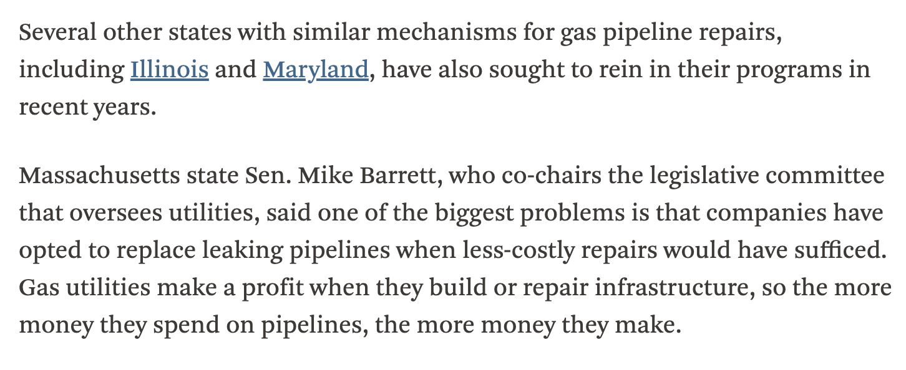{fig-alt="WBUR reporting that other states have similar pipeline-repair programs and that utility profits increase with infrastructure spending." width="94%"}

::: {.notes}
The complementary reporting supplies institutional detail about utilities'
incentives and similar programs in other states. It suggests both a mechanism
worth studying and possible comparison settings.
:::

## Exercise: refine your preliminary idea list

- For one idea, propose a causal identification strategy or a test of economic theory
- Present the idea's “bull case” and “bear case” to a classmate
- Ask your classmate to suggest another strategy or data source

## For Wednesday, September 16

- Complete the one-on-one meeting agenda in GitHub by 10:30 a.m. tomorrow
